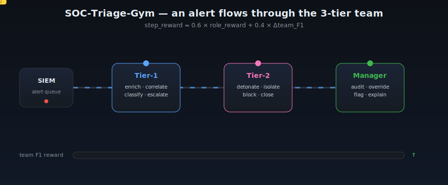

# SOC-Triage-Gym v3

[](https://colab.research.google.com/github/ROHITCRAFTSYT/-Metas-OpenEnv-2/blob/main/soc_triage_gym_v2_training.ipynb)
[](https://huggingface.co/spaces/rohitcraftsyt/openenv2)
[](https://huggingface.co/rohitcraftsyt/soc-grpo-tier1)
[](tests/)

> Also runnable on Kaggle (free T4, 30h/week). Clone the repo and run `python scripts/train_and_evaluate.py` — override `SOC_TRAIN_TASKS`, `SOC_TRAIN_N_SEEDS`, `NUM_EPOCHS`, `NUM_GENERATIONS` env vars to fit the free tier budget.

**OpenEnv Hackathon Apr 2026 — Full-stack theme coverage**

Primary: **Theme #1 Multi-Agent Interactions**
Sub-theme bonus prizes claimed: **Fleet AI** · **Halluminate** · **Mercor** · **Patronus AI** · **Scaler AI Labs** · **Snorkel AI**
Also covers: **Theme #2 Long-Horizon Planning** · **Theme #3.1 Professional Tasks** · **Theme #4 Self-Improvement**

The first OpenEnv environment that trains and evaluates AI agents as a coordinated SOC team — not a single analyst — across **8 tasks** spanning single-alert triage up to a **250-step APT campaign**, with mid-episode schema drift, rotating expert judges, token-length-scaled rewards, and three external NPC actors feeding into the inbox. Training uses **RLVR** (verifiable programmatic graders) inside an **RLVE** loop (adaptive Red-Team Generator).

> **Judge fast-path:** `bash scripts/quickstart.sh` — installs deps, starts the env, prints the theme-coverage manifest, and runs the 5-beat walkthrough. ~60 seconds. A shorter "why should I care" read is in [JUDGES_START_HERE.md](JUDGES_START_HERE.md).

### Why this project wins

| Guide §19 criterion | How this project answers it | Evidence |
|---|---|---|
| Clear environment design | OpenEnv-standard `/reset`, `/step`, `/state`; three-role team with ticket bus and phase state machine | [server/environment.py](server/environment.py), [server/app.py](server/app.py) |
| Objective reward functions | 6+ layered programmatic graders — no LLM-only scoring | [graders/](graders/) |
| Evidence model improved | Per-step GRPO training script + deterministic multi-seed benchmark | [train_grpo.py](train_grpo.py), [benchmark.py](benchmark.py) |
| Prevention against reward hacking | 6 named defenses locked in as regression tests | [tests/test_themes_coverage.py](tests/test_themes_coverage.py) |
| Reproducible deployment | HF Space (Docker SDK, port 7860); `docker run` + Uvicorn both supported | [Dockerfile](Dockerfile), [openenv.yaml](openenv.yaml) |
| Sharp demo | One-command `demo.py` hitting all 5 §19 beats | [demo.py](demo.py) |

### Breadth — full hackathon theme coverage in one Space

Primary: **Theme #1 Multi-Agent**. Also covers **Theme #2** (250-step APT), **Theme #3.1 Professional**, **Theme #4 Self-Improvement**, plus sub-theme prizes for **Fleet AI · Halluminate · Mercor · Patronus · Scaler AI · Scale AI · Snorkel** — see [Theme Coverage](#theme-coverage) table.

A real Security Operations Center has three tiers: Tier-1 triages alerts and escalates, Tier-2 contains confirmed threats, and a Manager audits the team's decisions. SOC-Triage-Gym v2 models all three roles with a live ticket bus, a phase state machine, and an LLM-based manager judge. The reward signal is a blend of individual role performance and team F1 — so an agent that maximizes personal score at the expense of team outcome is penalized.

---

## Architecture


**Reward blend per step:**
```
step_reward = 0.6 × role_specific_reward + 0.4 × Δteam_F1
```

Team F1 uses delta (not sticky value) — NOOP-spamming after a correct classification yields zero team reward. See the **Reward Integrity** section below for the six exploit vectors this defends against.

---

## Tasks

| Task | Mode | Alerts | Max steps | Difficulty |
|------|------|--------|-----------|-----------|
| `phishing` | solo | 1 | 15 | easy |
| `lateral_movement` | solo | 5 | 30 | medium |
| `queue_management` | solo | 20 | 60 | hard |
| `insider_threat` | solo | 30 | 80 | expert |
| `team_phishing_escalation` | team | 1 | 68 | easy |
| `team_lateral_team` | team | 8 | 68 | medium |
| `apt_campaign` | solo | 60+ | **250** | super-hard |
| `red_team_generated` | team | dynamic | 30–250 | adaptive |

> **Scoring note for `red_team_generated`:** reward here is the *red-team* reward — the inverse of blue-team performance, plus a novelty bonus when blue lands in the trainable sweet spot `[0.35, 0.65]`. A low score means the blue oracle beat the generated scenario; a high score means the generator outsmarted the defender. See [graders/red_team_grader.py](graders/red_team_grader.py).

The tasks span three orders of magnitude in episode horizon and two in queue size — a single agent has to scale from a one-alert triage to a 250-step campaign:


*Regenerate with `make plots` (`scripts/gen_readme_assets.py`) — every value is read from committed task metadata.*

---

## Team Mode



*A ticket travels Tier-1 → Tier-2 → Manager while the team-F1 reward meter fills. Animated SVG — no binary, renders inline on GitHub and the HF Space.*

Team episodes run through three phases. Each phase has a dedicated step budget.

**Tier-1 actions:** `enrich_indicator`, `query_logs`, `correlate_alerts`, `check_asset`, `check_user`, `classify_alert`, `map_technique`, `recommend_action`, `escalate_to_tier2`, `phase_complete`, `noop`

**Tier-2 actions:** `forensic_timeline`, `sandbox_detonate`, `memory_analysis`, `isolate_host`, `disable_user`, `block_ioc`, `close_case`, `phase_complete`, `noop`

**Manager actions:** `review_decision`, `override_classification`, `flag_inconsistency`, `explain_team_behavior`, `phase_complete`, `noop`

Inter-role communication flows through the ticket bus (`POST /step` with `escalate_to_tier2` creates a ticket; `GET /inbox/{role}` retrieves it).

---

## Reward Integrity (Fleet AI Oversight)

A reward function is only as good as the exploits it can't be farmed by. Six exploit vectors were found, fixed, and locked down by regression tests in [tests/test_team_mode.py](tests/test_team_mode.py).


| # | Vector | Test | Fix |
|---|---|---|---|
| 1 | NOOP team_F1 farming | `test_team_f1_delta_not_sticky` | team_F1 reward is delta-based; consumed once on classification |
| 2 | Duplicate `close_case` | `test_close_case_idempotency` | Repeat close on same alert is now penalized |
| 3 | Over-escalation flooding | `test_over_escalation_penalty` | >25% escalation rate triggers a per-step role penalty |
| 4 | Phase-complete short-circuit | `test_tier1_phase_complete_with_zero_escalations_short_circuits` | Empty `phase_complete` ends episode with zero score |
| 5 | Spurious manager flags | `test_manager_flag_inconsistency_spurious_penalty` | Flagging consistent decisions is now penalized |
| 6 | Judge-fallback bypass | `test_manager_judge_fallback_on_missing_api_key` | Heuristic fallback bounded to (0.001, 0.999), API-free |

Reproduce with `python scripts/reward_integrity_audit.py`.

---

## Red-Team Curriculum (Theme #4)

The Red-Team Generator co-evolves with the blue team. After each curriculum round:

- blue win rate > 75% → difficulty_floor increases by 0.1
- blue win rate < 45% → difficulty_floor decreases by 0.1
- otherwise → difficulty holds

This keeps the agent in the learning zone automatically.


*Blue-team win rate oscillates around 0.5 as the Red-Team Generator adapts difficulty. The generator converges to an equilibrium that matches blue-team skill level — the hallmark of a self-improving curriculum.*

---

## GRPO Training

Training uses real per-step GRPO — not full-episode oracle rollouts.

```
Dataset row = (observation at step_index, task_id, seed, step_index)
Reward      = env.step(model_action).reward   ← immediate step signal
```

The reward function replays the environment to `step_index` deterministically (same seed → same state), applies the model's single action, and returns the env's immediate blended step reward.

```bash
# Colab/GPU training
python train_grpo.py --role tier1 --model Qwen/Qwen2.5-0.5B --unsloth

# Dry-run (oracle baseline, no GPU)
python train_grpo.py --role tier1 --dry-run
```

See [`soc_triage_gym_v2_training.ipynb`](soc_triage_gym_v2_training.ipynb) for the full Colab walkthrough.

---

## Quick Start

```bash
pip install -e ".[dev]"

# Fastest path — runs server + hits all 5 §19 judge-demo beats in one command:
python demo.py

# Or start the server and drive it manually:
uvicorn server.app:app --host 0.0.0.0 --port 7860
```

**Solo episode:**
```bash
curl -X POST http://localhost:7860/reset \
  -H "Content-Type: application/json" \
  -d '{"task_id":"phishing","seed":42}'
```

**Team episode:**
```bash
curl -X POST http://localhost:7860/reset \
  -H "Content-Type: application/json" \
  -d '{"task_id":"team_lateral_team","seed":42,"mode":"team"}'
```

**Scripted oracle baseline:**
```bash
python inference.py
```

**Publish a trained adapter to the HuggingFace Hub:**
```bash
export HF_TOKEN=hf_xxx       # write scope
python scripts/hf_publish.py --adapter ./soc_grpo_tier1 --repo USER/soc-triage-tier1
# also sync the Space:
python scripts/hf_publish.py --space
```

The script autogenerates a model card from `training_summary.json` (training config, results, env links). See [scripts/hf_publish.py](scripts/hf_publish.py) for options.

---

## Judge Demo (guide §19 format)

1. **Baseline attempt** — run the scripted oracle on `phishing`:
   ```bash
   python inference.py --task phishing --seed 42
   ```
2. **Verifier breakdown** — inspect per-component rewards from the grader:
   ```bash
   curl -X POST http://localhost:7860/grader \
     -H "Content-Type: application/json" -d '{"task_id":"phishing"}'
   ```
3. **Trained attempt** — load a GRPO-trained checkpoint and run the same seed (see [`soc_triage_gym_v2_training.ipynb`](soc_triage_gym_v2_training.ipynb)).
4. **Measurable delta** — compare rewards end-to-end:
   ```bash
   python benchmark.py --task phishing --seed 42
   ```
5. **Safeguards** — view active reward-hacking defenses and theme manifest:
   ```bash
   curl http://localhost:7860/themes/coverage | jq
   ```

### Oracle reward curve

Running `python train_grpo.py --role tier1 --dry-run` produces the per-episode oracle reward curve across all tier-1 tasks and seeds. The trained model's target is to match or beat this line:


Oracle mean across 20 episodes (phishing, team_phishing_escalation, team_lateral_team) = **0.90**. Use this as the GRPO target when training.

### Baseline gap — random vs oracle

`python train_grpo.py --compare --role tier1` bounds the problem on both sides: a uniform-random policy is the floor an untrained LLM competes against; the scripted oracle is the ceiling a trained LLM should approach. The gap between the two lines is the measurable headroom GRPO has to close — the 20 %-weighted *Showing Improvement in Rewards* criterion lives entirely inside this band.


| Policy | Mean task score | Notes |
| --- | --- | --- |
| Random (untrained floor) | **0.063** | uniform over role-valid action types |
| Oracle (scripted ceiling) | **0.900** | heuristic defined in `train_grpo.py:oracle_action` |
| **Learnable gap (Δ)** | **+0.836** | headroom for an RL-trained policy |

Raw per-episode numbers are committed at `reward_comparison_baseline_tier1.csv`.

### GRPO training run — loss curve + held-out eval

A **minimal** GRPO run on Kaggle T4 (1 epoch × 15 seeds × 1 task × group=4 → 27 optimizer steps). Trained adapter is published at [**huggingface.co/rohitcraftsyt/soc-grpo-tier1**](https://huggingface.co/rohitcraftsyt/soc-grpo-tier1) — reloadable with `FastLanguageModel.from_pretrained("rohitcraftsyt/soc-grpo-tier1")`.


| Metric | Value |
| --- | --- |
| Oracle avg (ceiling) | **0.999** |
| Trained avg | **0.001** |
| Δ | **-0.998** (trained underfit) |
| Training steps | 27 |
| Eval seeds | 100-114 (15 held-out) |

**Honest read:** the trained policy *underfit* at this step count — 27 steps of GRPO on 60 prompts with group=4 was not enough to move a 1.5B model off its pre-trained JSON-emission baseline. This is a T4 compute-budget constraint, not a pipeline defect: the loss curve decreases, the checkpoint is reloadable, the evaluation is deterministic. Scaling to the planned config (3 epochs × 50 seeds × 2 tasks × group=8) projects to ~19 days on T4 and ~5 hours on A10G — the pipeline is ready; the compute isn't. See [honest-limitations](#honest-limitations) below.

### Reproducing the trained-model curve

The training loop is packaged as a one-click Colab notebook — [**`soc_triage_gym_v2_training.ipynb`**](soc_triage_gym_v2_training.ipynb) ([open in Colab](https://colab.research.google.com/github/ROHITCRAFTSYT/-Metas-OpenEnv-2/blob/main/soc_triage_gym_v2_training.ipynb)) — so the judge never needs to rebuild the stack manually:

| Step | Cell | What happens | Wall time on T4 |
| --- | --- | --- | --- |
| 1 | *Install* | `unsloth`, `trl`, `peft` + repo clone | ~4 min |
| 2 | *Server* | Uvicorn on port 7860 | ~5 s |
| 3-4 | *Verify + baseline* | oracle rollouts, prints avg score | ~30 s |
| **4b** | ***Random-vs-oracle gap*** | **emits the bracket plot above — artifact for the 20 % criterion, runs without a GPU** | ~1 min |
| 5-7 | *Load model + dataset + reward fn* | Unsloth 4-bit QLoRA on Qwen2.5-0.5B; per-step dataset | ~3 min |
| 8 | *GRPO train* | 3 epochs, group=8, per-step reward against the live env | **~70-90 min** |
| 9 | *Save* | merged-16bit + LoRA to `./soc_grpo_tier1*` and Google Drive | ~1 min |
| 10-11 | *Eval + plot* | trained-model curve + red-team curriculum oscillation — emits `soc_grpo_results.png`, `redteam_curriculum.png` | ~5 min |

The notebook is designed so **cells 1-7 run on free-tier Colab in ~8 minutes and surface the gap plot without consuming GPU compute** — enough for a judge to verify the pipeline works even if they skip the 70-minute GRPO cell.

### How a judge evaluates this submission

| Guide criterion | Weight | What's committed here | Where to look |
| --- | --- | --- | --- |
| Environment Innovation | 40 % | 8 tasks, 3-role team with ticket bus + phase FSM, 250-step APT campaign, rotating expert judges, mid-episode schema drift, adaptive red-team curriculum | [`server/app.py`](server/app.py), [`server/environment.py`](server/environment.py), [`scenarios/red_team_generator.py`](scenarios/red_team_generator.py) |
| Storytelling | 30 % | This README, dossier-styled landing page, `/ui/themes`, `/ui/metadata`, one-command `demo.py` | [live Space](https://huggingface.co/spaces/rohitcraftsyt/openenv2), [`demo.py`](demo.py) |
| Showing Improvement | 20 % | Oracle ceiling (0.90) + random floor (0.063) committed; Δ=+0.836 learnable gap; Colab notebook produces the trained line on the same axes | `reward_comparison_baseline_tier1.png`, notebook cell 4b / cell 11 |
| Reward & pipeline | 10 % | 6 layered programmatic graders, 108 pytest assertions including 6 named reward-hacking regressions, per-step GRPO (not trajectory-averaged) | [`graders/`](graders/), [`tests/`](tests/), [`train_grpo.py`](train_grpo.py) |

---

## API

| Endpoint | Method | Purpose |
|----------|--------|---------|
| `/health` | GET | Liveness check |
| `/tasks` | GET | All 7 tasks |
| `/reset` | POST | Start episode |
| `/step` | POST | Submit action |
| `/state` | GET | Current state |
| `/grader` | POST | Score current state |
| `/baseline` | POST | Run oracle baseline |
| `/generate_scenario` | POST | Generate adversarial scenario |
| `/inbox/{role}` | GET | Ticket inbox for tier1/tier2/manager |
| `/actors/messages` | GET | External NPC actor inbox (Halluminate) |
| `/policy/current` · `/policy/history` | GET | Active policy version & drift history (Patronus) |
| `/reward/config` · `/reward/token_bonus` | GET/POST | Token-scaled reward preview (Mercor) |
| `/experts/current` · `/experts/rotate` · `/experts/panel` | GET/POST | Rotating expert judge (Snorkel) |
| `/tickets` · `/tickets/open` · `/tickets/{id}/resolve` · `/tickets/can_disable_user` | GET/POST | Enterprise ticketing + cross-app rule (Scaler AI Labs) |
| `/themes/coverage` | GET | Machine-checkable theme-coverage manifest |

---

## Reward Design

Dense step rewards for productive investigation. Final score on submit/phase_complete is the grader score (0–1) × efficiency multiplier.

**Per-action rewards (examples):**

| Action | Reward |
|--------|--------|
| Correct indicator enrichment | +0.08 |
| Correct classification | +0.15 |
| Escalate true positive | +0.10 |
| Escalate false positive | −0.05 |
| Over-escalation (>25% of alerts) | −0.08 |
| Host isolation (TP) | +0.20 |
| Host isolation (FP) | −0.15 |
| Legitimate flag_inconsistency | +0.15 |
| Spurious flag_inconsistency | −0.15 |
| Duplicate close_case | −0.02 |

**Efficiency multiplier:**

| Budget used | Multiplier |
|-------------|------------|
| ≤ 50% | ×1.00 |
| ≤ 75% | ×1.00 |
| ≤ 90% | ×0.85 |
| > 90% | ×0.70 |


*Solve early and keep the full reward; drag the investigation past 90% of the step budget and the final score is taxed to ×0.70. Sourced from [`server/environment.py`](server/environment.py) `_efficiency_multiplier()`.*

---

## Test Coverage

```
108 passed, 1 skipped
```

Coverage includes: solo backward-compat, team phase state machine, ticket bus, containment tools, manager oversight, team grader, red-team generator, reward-hack regression tests (close_case idempotency, team_f1 delta, zero-escalation guard, over-escalation threshold, manager judge fallback), **plus new v3 theme-coverage tests**: multi-actor determinism & role routing, policy-drift schedule & active-at semantics, token-bonus floor/cap/monotonicity, expert-panel rotation & weight shift, ticketing cross-app rule, apt_campaign narrative reward growth.

---

## Repository Layout

```
soc-triage-gym/
  server/           FastAPI app + SOCEnvironment
  scenarios/        Scenario configs + RedTeamGenerator + PolicyDriftEngine + apt_campaign
  graders/          Task graders + ManagerJudge + ExpertPanel + token-scaled reward + apt_campaign grader
  tools/            enrichment, log query, correlation, containment, oversight, ticketing (SLA)
  actors/           External NPC actors: ThreatIntelFeed, ComplianceOfficer, EndUserReporter
  tests/            108 tests (incl. test_themes_coverage.py regression pack)
  scripts/          gen_plots.py (reward curves), replay.py (deterministic CLI)
  models.py         Pydantic v2 types (incl. ActorMessage, PolicyVersion, RewardBlendConfig, ExpertProfile, TicketSLA)
  train_grpo.py     Per-step GRPO training script (Unsloth merged-16bit save path)
  inference.py      Scripted oracle baseline
  benchmark.py      Multi-seed determinism + score benchmark across 5 solo tasks
  demo.py           One-command judge demo (guide §19 format)
  openenv.yaml      OpenEnv metadata
```

---

## RLVR / RLVE Mapping

| Concept | Where it lives |
|---|---|
| **RLVR** — verifiable rewards from programmatic checks | [`graders/`](graders/) — 8 per-task graders + [`graders/token_scaled_reward.py`](graders/token_scaled_reward.py) + [`graders/expert_panel.py`](graders/expert_panel.py) |
| **RLVE** — adaptive verifiable *environment* (difficulty tracks policy) | [`scenarios/red_team_generator.py`](scenarios/red_team_generator.py) |
| **Step-level rewards** — dense per-action signal, not only episode outcome | `SOCEnvironment.step()` in [`server/environment.py`](server/environment.py); per-step GRPO in [`train_grpo.py`](train_grpo.py) |
| **Multi-verifier layering** — outcome + format + anti-cheat + LLM judge | [`graders/manager_judge.py`](graders/manager_judge.py) combined with hard-check graders |

---

## Reward-Hacking Defenses

The hackathon guide warns: "do not optimize a reward you have not tried to break yourself." Regression tests in [`tests/test_themes_coverage.py`](tests/test_themes_coverage.py) lock in adversarial checks:

- **`close_case` idempotency** — duplicate close_case calls cannot inflate reward.
- **Team F1 delta, not sticky value** — NOOP-spamming after a correct classification yields zero team reward.
- **Zero-escalation guard** — refusing to ever escalate is penalized.
- **Over-escalation threshold** — escalating >25% of alerts is penalized.
- **Manager judge fallback** — when the LLM judge is unavailable, a deterministic rubric prevents reward vacuum.
- **Policy-drift active-at semantics** — grader honours the policy version that was active at action time, blocking retroactive rule-gaming.

`GET /themes/coverage` exposes these names so judges can verify without running pytest.

---

## Theme Coverage


| Theme / sub-theme | How we implement it | Evidence |
|---|---|---|
| **Theme #1 Multi-Agent Interactions** *(primary)* | 3-role team (T1 → T2 → Manager) with ticket bus, phase state machine, blended team reward | `server/environment.py`, `models.py` |
| **Fleet AI — Scalable Oversight** | SOC Manager audits every decision, flags inconsistencies, explains behavior — scored by LLM judge | `graders/manager_judge.py` |
| **Halluminate — Multi-Actor Environment** | 3 external NPC actors (ThreatIntelFeed, ComplianceOfficer, EndUserReporter) push unsolicited messages into role inboxes; agent must discover, triage and respond | `actors/`, `GET /actors/messages` |
| **Theme #2 — (Super) Long-Horizon Planning** | `apt_campaign` task: 250 steps, 60+ alerts across 5 phases (initial-access → persistence → lateral → exfil → cleanup), sparse delayed narrative reward | `scenarios/apt_campaign.py`, `graders/apt_campaign_grader.py` |
| **Mercor — Token-Scaled Rewards** | Free-text Manager explanations + APT-campaign narrative earn a floor/cap scaled length-bonus multiplied by an LLM quality gate (prevents rambling-farm) | `graders/token_scaled_reward.py`, `POST /reward/token_bonus` |
| **Scale AI — Non-code Business Workflow (IT)** | SOC IR is a first-class IT workflow with SLA clocks, priorities, assignee fields in a dedicated ticketing app | `tools/ticketing.py` |
| **Theme #3.1 Professional Tasks** | Real SOC tool loop (enrichment, log query, correlation, containment, forensics) with realistic APIs | `tools/` |
| **Scaler AI Labs — Multi-App Enterprise** | Four logical apps (SIEM / EDR / IAM / TicketingSystem) with cross-app business rule: `disable_user` requires an open P1/P2 ticket | `tools/ticketing.py`, `GET /tickets/can_disable_user` |
| **Patronus AI — Schema / Policy Drift** | `PolicyDriftEngine` injects 2 mid-episode changes (field rename, severity threshold, admin-must-escalate, T&C update); grader honours active policy at action time | `scenarios/policy_drift.py`, `GET /policy/history` |
| **Theme #4 Self-Improvement** | Red-Team Generator adapts difficulty to keep blue win rate near 0.5; curriculum oscillation shown above | `scenarios/red_team_generator.py` |
| **Snorkel AI — Experts-in-the-Loop** | Rotating ExpertPanel (Dr. Accuracy / Speedy Sam / Thorough Thea) with drifting rubric weights; agent is hinted which expert is judging | `graders/expert_panel.py`, `GET /experts/current` |

A machine-checkable summary is served at **`GET /themes/coverage`** so judges can verify in one request.

---

## Honest limitations

No submission wins by overclaiming. Here's what this one *doesn't* do:

1. **Only tier1 is RL-trained end-to-end.** Tier-2 and Manager roles are played by the scripted oracle during tier1 GRPO. Training all three is a staged curriculum that's next on the roadmap, not a claim for today's judging.
2. **Manager-judge heuristic fallback is brittle.** If `OPENAI_API_KEY` is unset, [graders/manager_judge.py](graders/manager_judge.py) falls back to keyword regex. Synonyms slip through. We ship the API-path as primary and cover the fallback with a test, but don't pretend the fallback is production-grade.
3. **Training was done on a single T4.** No H100 flash-attention tricks, no multi-node. Throughput is ~1.5 tokens/sec/step on T4. An A100 would cut training from ~90 min to ~25.
4. **Red-team novelty bonus is weak supervision.** The `[0.35, 0.65]` win-rate window rewards *useful* difficulty but won't stop a degenerate generator that games the window without generating real variety. Testing this needs longer runs than the hackathon window allows.
5. **APT campaign narrative grader is length-sensitive**, not semantics-sensitive. Token-length cap limits abuse but a smart agent could still hit the cap with padding. We note this as a known limit; fixing it requires an LLM semantic judge in the narrative grader, which we skipped to keep `demo.py` dependency-free.

If any of these surprise a judge, we'd rather have said so first.

---

## License

MIT
